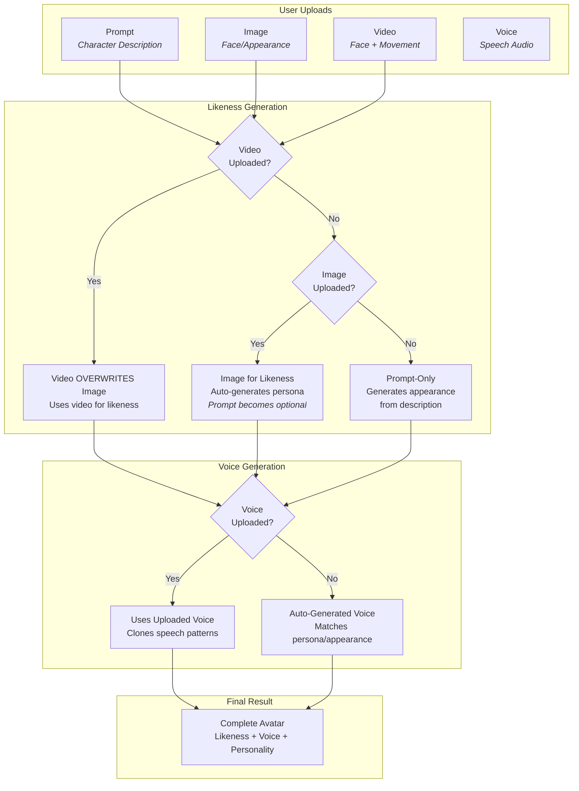

Learn how to prepare and upload media for optimal avatar generation results.

---

## Image Upload

**Perfect for**: Facial likeness and character appearance

### Requirements

| Requirement | Value |
|-------------|-------|
| File Size | Less than 10MB |
| Characters | One person only |
| Position | Centered in frame |
| Orientation | Front-facing |
| Expression | Calm and gentle |
| Quality | High resolution, well-lit |

### Best Practices

- **Good lighting** — avoid shadows on face
- **Clear focus** — sharp, not blurry
- **Solo shots** — no other people visible
- **Neutral expression** — avoid extreme emotions
- **Professional quality** — passport-style photos work well

---

## Video Upload

**Perfect for**: Movement patterns and dynamic expressions

### Requirements

| Requirement | Value |
|-------------|-------|
| Duration | Less than 30 seconds |
| Characters | One person only |
| Position | Centered in frame |
| Movement | Minimal distracting movement |
| Quality | High resolution, stable footage |

### Best Practices

- **Stable camera** — use tripod if possible
- **Consistent framing** — keep character centered
- **Subtle movements** — gentle head movements, natural blinking
- **Good lighting** — consistent throughout video
- **Audio optional** — focus on visual quality

---

## Voice Upload

**Perfect for**: Voice cloning and personalized speech patterns

### Requirements

| Requirement | Value |
|-------------|-------|
| Duration | Less than 1 minute |
| Quality | Clear voice, no background noise |
| Format | MP3, WAV, or M4A |
| Content | Natural speech in your target language |

### Best Practices

- Record in a quiet environment
- Use a good quality microphone
- Speak naturally and clearly
- Avoid music or sound effects
- Include varied sentences for better voice modeling

---

## Media Priority System

Understanding how different uploads influence and overwrite each other:

### Key Priority Rules

1. **Video > Image** — Video always overwrites image for likeness
2. **Image = Auto-Prompt** — Images auto-generate persona, making manual prompts optional
3. **Voice** — When uploaded, replaces auto-generated voice
4. **Prompt** — Required only when no image/video provided

### Upload Combinations

| Combination | What Happens |
|-------------|-------------|
| **Prompt Only** | Generates likeness, voice, and movement from text description |
| **Image Only** | Uses image for likeness, auto-generates persona and voice |
| **Voice + Image** | Image for likeness, voice for speech patterns |
| **Video + Voice + Prompt** | Full character control — video for likeness, voice for speech, prompt for personality |

---

## Best Practices

<Tip>
**Start simple.** Upload an image for instant results, or use prompts for creative characters. You can always add voice or refine later.
</Tip>

**Recommended Approaches:**

- **Prompts Only** — Good for creative/fictional characters
- **Image Only** — Instant avatar from photo (no prompt needed)
- **Image + Voice** — Realistic character recreation

**Common Issues and Fixes:**

| Issue | Fix |
|-------|-----|
| Poor lighting in images/videos | Use photo editing to improve lighting |
| Background noise in audio | Record audio in quiet spaces |
| Multiple people in frame | Crop images to show only target person |
| Excessive movement in videos | Keep movements subtle and natural |
