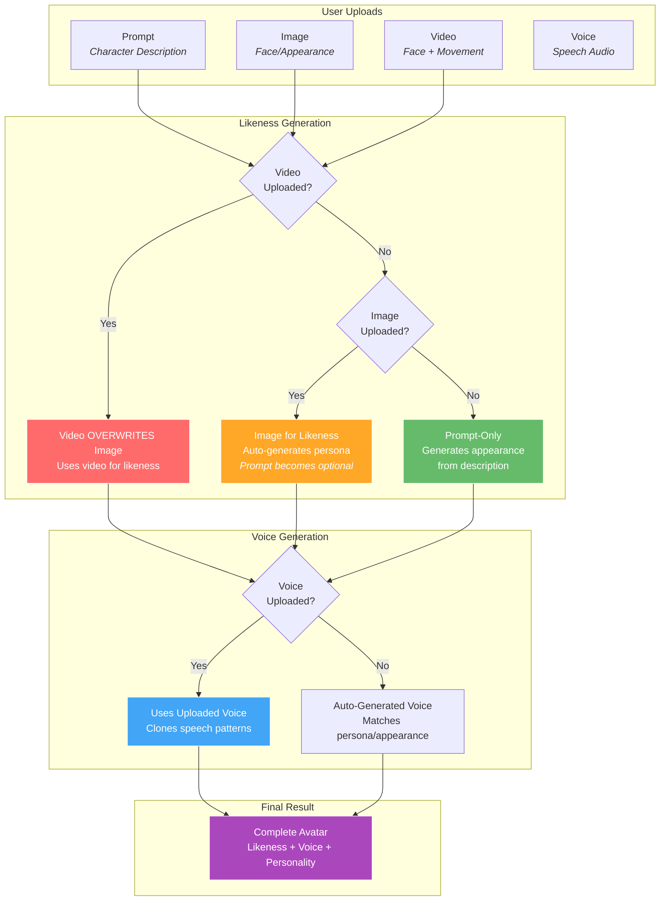

# Media Guide

> **Upload your voice, image, and video to create personalized avatars.**

Learn how to prepare and upload media for optimal avatar generation results.

---

## Media Upload Overview

The ImagineX platform accepts multiple types of media to create avatars. Each type serves a specific purpose in building your character's appearance, voice, and personality.

*Follow our guidelines for optimal media uploads*

---

## Image Upload

**Perfect for**: Facial likeness and character appearance

### Requirements:
- **File Size**: Less than 10MB
- **Character Count**: One and only one person in the image
- **Position**: Character centered in frame
- **Orientation**: Camera facing (front-view)
- **Expression**: Calm and gentle expression
- **Quality**: High resolution and well-lit

### Best Practices:
- **Good lighting** -- avoid shadows on face
- **Clear focus** -- sharp, not blurry
- **Solo shots** -- no other people visible
- **Neutral expression** -- avoid extreme emotions
- **Professional quality** -- passport-style photos work well

---

## Video Upload

**Perfect for**: Movement patterns and dynamic expressions

### Requirements:
- **Duration**: Less than 30 seconds
- **Character Count**: One and only one person in frame
- **Position**: Character centered in frame
- **Movement**: Minimal distracting movement
- **Quality**: High resolution, stable footage

### Best Practices:
- **Stable camera** -- use tripod if possible
- **Consistent framing** -- keep character centered
- **Subtle movements** -- gentle head movements, natural blinking
- **Good lighting** -- consistent throughout video
- **Audio optional** -- focus on visual quality

---

## Voice Upload

**Perfect for**: Voice cloning and personalized speech patterns

### Requirements:
- **Duration**: Less than 1 minute
- **Quality**: Clear voice without background noise
- **Format**: MP3, WAV, or M4A
- **Content**: Natural speech in your target language

### Best Practices:
- **Record in a quiet environment**
- **Use a good quality microphone**
- **Speak naturally and clearly**
- **Avoid music or sound effects**
- **Include varied sentences** for better voice modeling

---

## Media Priority System

Understanding how different uploads influence and overwrite each other:

### Key Priority Rules:
1. **Video > Image** -- Video always overwrites image for likeness
2. **Image = Auto-Prompt** -- Images auto-generate persona, making manual prompts optional
3. **Voice** -- When uploaded, replaces auto-generated voice
4. **Prompt** -- Required only when no image/video provided

### Upload Combinations:

**Prompt Only:**
- Generates likeness, voice, and movement from text description
- Good for fictional characters or specific personas

**Image Only:**
- Uses image for likeness
- Auto-generates persona and voice from appearance
- **No prompt needed** -- system derives personality from image
- Good for bringing photos to life instantly

**Voice + Image:**
- Image provides likeness
- Voice provides speech patterns
- System generates personality to match
- Good for realistic character recreation

**Video + Voice + Prompt:**
- Video provides likeness and movement style
- Voice provides speech patterns
- Prompt guides personality
- Full character control

---

## Best Practices

**Recommended Approaches:**

**Simple and Effective:**
- **Prompts Only** -- Good for creative/fictional characters
- **Image Only** -- Instant avatar from photo (no prompt needed)
- **Image + Voice** -- Realistic character recreation

**Iterative Refinement:**
- Start with image for instant results, or basic prompts for creative concepts
- Add voice for personalization
- Upload image when you want specific likeness
- Fine-tune and change elements anytime

**Common Issues:**
- Poor lighting in images/videos
- Background noise in audio
- Multiple people in frame
- Excessive movement in videos

**Quick Fixes:**
- Use photo editing to improve lighting
- Record audio in quiet spaces
- Crop images to show only target person
- Keep movements subtle and natural

Start simple. Upload an image for instant results, or use prompts for creative characters. You can always add voice or refine later.